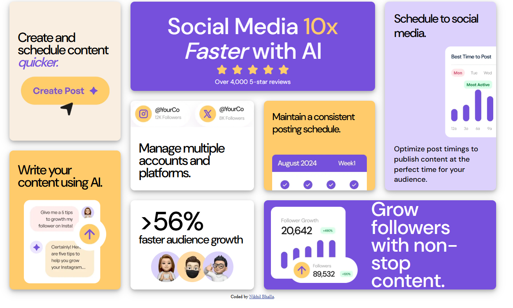

# CTI-110 Final Project - Bento Grid by Nikhil Bhalla

## Table of contents

- [CTI-110 Final Project - Bento Grid by Nikhil Bhalla](#cti-110-final-project---bento-grid-by-first-name-last-name)
  - [Table of contents](#table-of-contents)
  - [Overview](#overview)
    - [The challenge](#the-challenge)
    - [Screenshot](#screenshot)
    - [Links](#links)
  - [My process](#my-process)
    - [Built with](#built-with)
    - [What I learned](#what-i-learned)
    - [Continued development](#continued-development)
    - [Useful resources](#useful-resources)
  - [Author](#author)
  - [Acknowledgments](#acknowledgments)

## Overview

### The challenge

Users should be able to:

- View the optimal layout for the interface depending on their device's screen size

### Screenshot



Add a screenshot of your solution. The easiest way to do this is to use Firefox or other browser to view your project, right-click the page and select "Take a Screenshot". You can choose either a full-height screenshot or a cropped one based on how long the page is. If it's very long, it might be best to crop it.


### Links

- Repository URL: [https://github.com/dudemillion/CTI110FinalProject](https://github.com/dudemillion/CTI110FinalProject)
- Live Site URL: [Add live site URL here](https://your-live-site-url.com)

## My process

### Built with

- [CSS Grid Generator](https://cssgridgenerator.io/)
- A little bit of Flexbox
- My Brain

### What I learned

This project definitely helped me learn a lot more about CSS. I already have a great understanding
of HTML, and coded that with no problems, mostly without googling anything. However, CSS became
the issue when it came to making it look like... what it needed to look like. However, tools like
the CSS Grid Generator assisted me to a great extent. It's likely I wouldn't have gotten as far as
I did without the CSS Grid Generator. It created a framework I could easily work off of, placing images
and correctly sizing everything.
When it came to making the scheduling box, I had to put 2 elements next to eachother. I searched online
how to do it, as when I set it to inline-block, it placed the text either at the bottom or the top alignment
of the image. When I searched it, a lot of people said to use flexboxes. So I took a small detour to figure
out how they work, and how to implement it into that box. It ended up well! Here's the code snippet of it.
```css
#Schedule {
    background-color: #dcd1fc;
    box-shadow: 0 4px 8px 0 rgba(0, 0, 0, 0.2), 0 6px 20px 0 rgba(0, 0, 0, 0.19);
    grid-row: span 4 / span 4;
    grid-column-start: 4;
    grid-row-start: 1;
    border-radius: 10px;
    display: flex;
    flex-direction: column;
    align-items: flex-start;
    justify-content: flex-start;
    gap: 16px;
    padding: 24px 0 26px 22px;
    overflow: hidden;
}
```

### Continued development

This project was especially useful for future careers and projects. This helped me learn to be more independent
from AI, where I would have used it for my CSS. I've now attained a broadened knowledge on CSS syntax, and can
use this to my advantage again if I ever need to build a website for personal use or even for a future job, as
my future dream job would be related to software development.

### Useful resources

- [CSS Grid Generator](https://cssgridgenerator.io/) - This was the entire backbone to my project. Without it, I don't know where
I would have ended up.
- [W3Schools Flexbox](https://www.w3schools.com/csS/css3_flexbox.asp) - W3Schools is a super useful tool to learn syntax. It
provides multiple examples and explains in beginner-friendly words. This article specifically helped me learn flexboxes to use
in that one part that I needed it for.

## Author

- Website - [Nikhil Bhalla](https://github.com/dudemillion)

## Acknowledgments

Really. I can't express it enough how much the Grid generator and W3Schools helped. They were crucial to the development of
this website, especially without the use of AI.
